# Hey, I'm Ruben Talstra 

**Software Engineer · Self-taught since 2013 · Open Source Enthusiast**

---

### About Me

- **Business IT & Management (BITM)** student in the Northern Netherlands
- Currently completing my **AI/Machine Learning minor** (Sep 2025 - Feb 2026)
- **12+ years** of self-taught programming experience
- Building a **FDA-compliant clinical trial tool** with Rust
- Specializing in **Rust**, **Flutter/Dart**, and **TypeScript**

---

### Languages

### Tools & Platforms

---

### Focus Areas

| Clinical Data Standards                     | AI/Machine Learning                            |
|---------------------------------------------|------------------------------------------------|
| SDTM · Controlled Terminology · ADaM · SEND | Transformers · Neural Networks · Deep Learning |
| *Applied in Trial-Submission-Studio*        | *Current minor focus*                          |

---

### Featured Project

---

### Stats

  

  
  

---

### Support

If you find my projects helpful, consider supporting my work!

---

### Let's Connect!

Reach out to me
on 

Check out my work
on 
